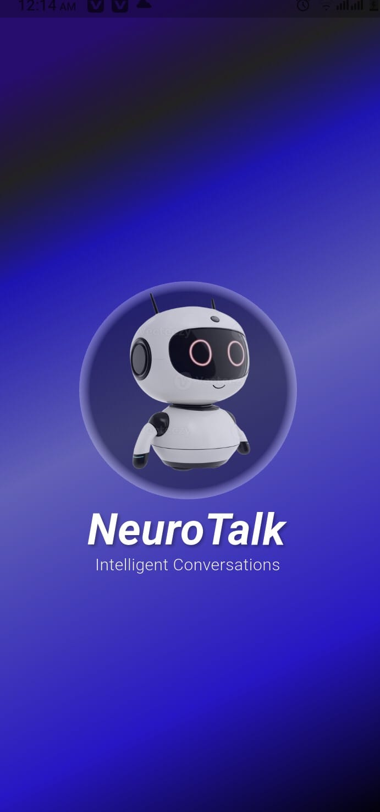
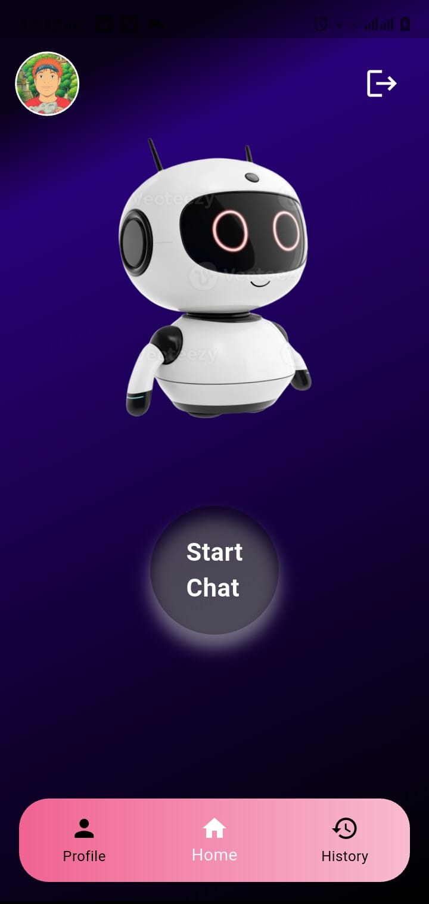
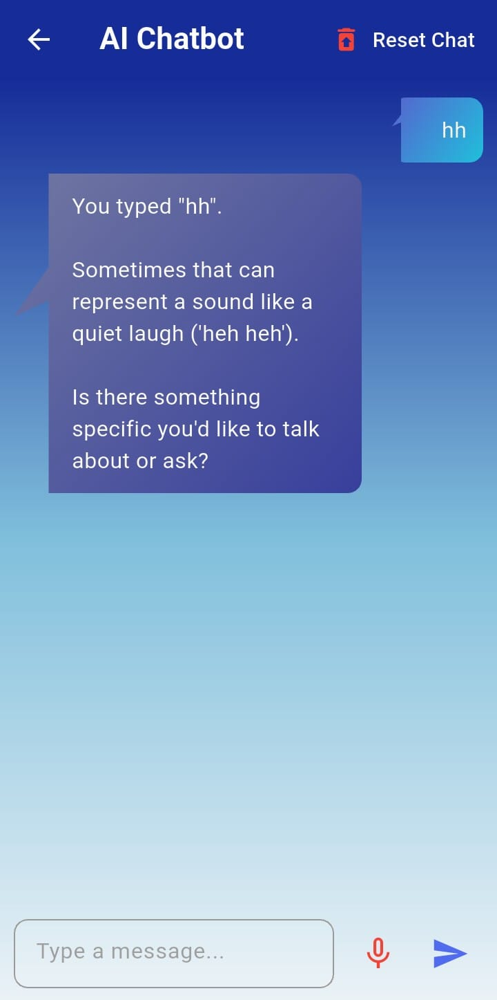
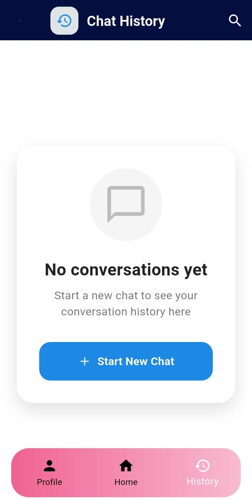

# flutter_Neurotalk_app

A new Flutter project.

## Getting Started

This project is a starting point for a Flutter application.

A few resources to get you started if this is your first Flutter project:

- [Lab: Write your first Flutter app](https://docs.flutter.dev/get-started/codelab)
- [Cookbook: Useful Flutter samples](https://docs.flutter.dev/cookbook)

For help getting started with Flutter development, view the
[online documentation](https://docs.flutter.dev/), which offers tutorials,
samples, guidance on mobile development, and a full API reference.

# NeuroTalk 🤖

NeuroTalk is an AI-powered chatbot application designed to make chatting with AI simple, smart, and helpful. Users can easily ask questions, get instant answers, and manage their chat history in one place.

---

## 🚀 Features



* 🔐 **Sign in with Google**  
  
  Users can securely sign in using their Google account. This provides a fast, safe, and hassle-free authentication experience without the need to remember passwords.

* ☁️ **Firebase Integration**

* 💬 **AI Chat (Typing Support)**  
  
  Users can chat with AI through a smooth and responsive text-based interface. The chatbot provides quick and accurate responses to user questions.

* 🎙️ **Voice Chat Support**

* 🕒 **Chat History Management**  
  
  All conversations are automatically saved in the database. Users can view their previous chats anytime, helping them track questions and answers easily.

* ✏️ **Edit Profile**

* ♻️ **Reset Chat**

---

## 🛠️ Tech Stack

* Frontend: **Flutter**
* Backend: Firebase
* Authentication: Google Sign-In (Firebase Auth)
* Database: Firebase Firestore / Realtime Database

---

## 📦 Installation & Setup

1. Clone the repository:

   ```bash
   git clone https://github.com/Asrar-Ashraf/first-flutter-project-Neurotalk-application.git
